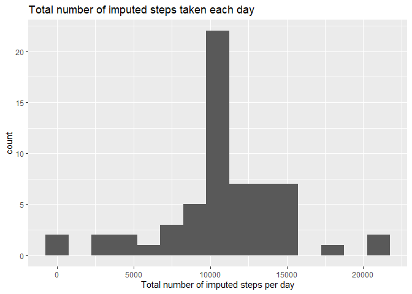
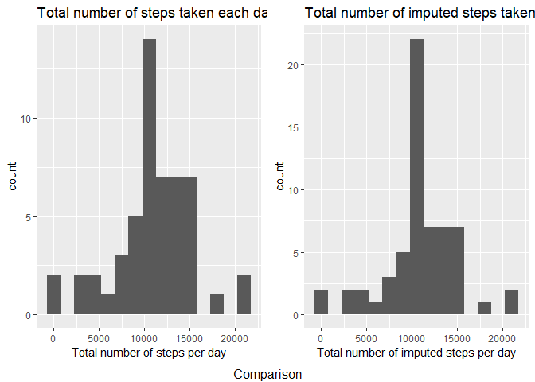
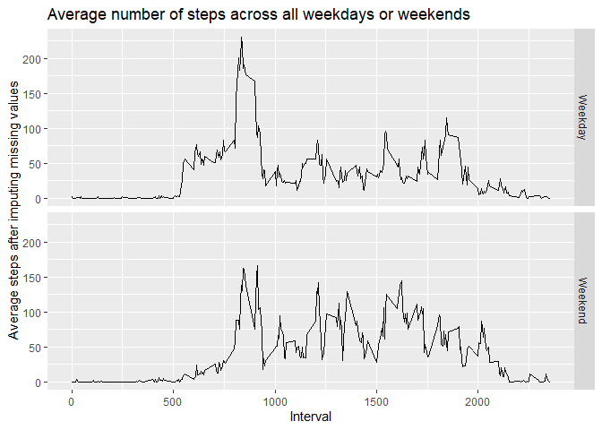

## Loading and preprocessing the data

Download the "activity.zip" file


```r
if(!file.exists("activity.zip")){
download.file("https://d396qusza40orc.cloudfront.net/repdata%2Fdata%2Factivity.zip","activity.zip")}
```

Unzip the file and read it in the object "activity" 


```r
unzip("activity.zip")
activity <- read.csv("activity.csv", header = TRUE, sep = ",")
head(activity)
```

```
##   steps       date interval
## 1    NA 2012-10-01        0
## 2    NA 2012-10-01        5
## 3    NA 2012-10-01       10
## 4    NA 2012-10-01       15
## 5    NA 2012-10-01       20
## 6    NA 2012-10-01       25
```

```r
summary(activity)
```

```
##      steps            date              interval     
##  Min.   :  0.00   Length:17568       Min.   :   0.0  
##  1st Qu.:  0.00   Class :character   1st Qu.: 588.8  
##  Median :  0.00   Mode  :character   Median :1177.5  
##  Mean   : 37.38                      Mean   :1177.5  
##  3rd Qu.: 12.00                      3rd Qu.:1766.2  
##  Max.   :806.00                      Max.   :2355.0  
##  NA's   :2304
```

Load libraries


```r
library(dplyr)
```

```
## Warning: package 'dplyr' was built under R version 4.0.4
```

```
## 
## Attaching package: 'dplyr'
```

```
## The following objects are masked from 'package:stats':
## 
##     filter, lag
```

```
## The following objects are masked from 'package:base':
## 
##     intersect, setdiff, setequal, union
```

```r
library(ggplot2)
library(gridExtra)
```

```
## Warning: package 'gridExtra' was built under R version 4.0.4
```

```
## 
## Attaching package: 'gridExtra'
```

```
## The following object is masked from 'package:dplyr':
## 
##     combine
```

## What is mean total number of steps taken per day?


```r
totalStepsPerDay <- activity %>%
    na.omit() %>%
    group_by(date = as.Date(date)) %>%
    summarise(TotalSteps = sum(steps, na.rm = TRUE))
totalStepsPerDay
```

```
## # A tibble: 53 x 2
##    date       TotalSteps
##    <date>          <int>
##  1 2012-10-02        126
##  2 2012-10-03      11352
##  3 2012-10-04      12116
##  4 2012-10-05      13294
##  5 2012-10-06      15420
##  6 2012-10-07      11015
##  7 2012-10-09      12811
##  8 2012-10-10       9900
##  9 2012-10-11      10304
## 10 2012-10-12      17382
## # ... with 43 more rows
```

##### Make a histogram of the total number of steps taken each day


```r
g1 <- ggplot(data = totalStepsPerDay, mapping = aes(TotalSteps))
g1Hist <- g1 + geom_histogram(binwidth = 1500) + ggtitle("Total number of steps taken each day (ignored missing data)") + xlab("Total number of steps per day")
g1Hist
```

<!-- -->

##### Calculate and report the mean and median total number of steps taken per day


```r
mean <- mean(totalStepsPerDay$TotalSteps)
mean
```

```
## [1] 10766.19
```


```r
median <- median(totalStepsPerDay$TotalSteps)
median
```

```
## [1] 10765
```

## What is the average daily activity pattern?

Make a time series plot (i.e. type = "l") of the 5-minute interval (x-axis) and the average number of steps taken, averaged across all days (y-axis)

Which 5-minute interval, on average across all the days in the dataset, contains the maximum number of steps?


```r
averageStepsPerInterval <- activity %>%
    na.omit() %>%
    group_by(interval) %>%
    summarise(averageSteps = mean(steps))
head(averageStepsPerInterval)
```

```
## # A tibble: 6 x 2
##   interval averageSteps
##      <int>        <dbl>
## 1        0       1.72  
## 2        5       0.340 
## 3       10       0.132 
## 4       15       0.151 
## 5       20       0.0755
## 6       25       2.09
```

## Imputing missing values

Calculate and report the total number of missing values in the dataset (i.e. the total number of rows with NAs)


```r
missingValue <- colSums(is.na(activity))
missingValue
```

```
##    steps     date interval 
##     2304        0        0
```

Devise a strategy for filling in all of the missing values in the dataset. The strategy does not need to be sophisticated. For example, you could use the mean/median for that day, or the mean for that 5-minute interval, etc.

    Filling the missing values with the mean for that 5-minute interval

Create a new dataset that is equal to the original dataset but with the missing data filled in.


```r
replaceNA <- activity %>%
    group_by(interval) %>%
    mutate(steps = replace(steps, is.na(steps), mean(steps, na.rm = TRUE))) 
replaceNA
```

```
## # A tibble: 17,568 x 3
## # Groups:   interval [288]
##     steps date       interval
##     <dbl> <chr>         <int>
##  1 1.72   2012-10-01        0
##  2 0.340  2012-10-01        5
##  3 0.132  2012-10-01       10
##  4 0.151  2012-10-01       15
##  5 0.0755 2012-10-01       20
##  6 2.09   2012-10-01       25
##  7 0.528  2012-10-01       30
##  8 0.868  2012-10-01       35
##  9 0      2012-10-01       40
## 10 1.47   2012-10-01       45
## # ... with 17,558 more rows
```

Make a histogram of the total number of steps taken each day and Calculate and report the mean and median total number of steps taken per day. Do these values differ from the estimates from the first part of the assignment? What is the impact of imputing missing data on the estimates of the total daily number of steps?


```r
ImputedData <- replaceNA %>%
    group_by(date = as.Date(date)) %>%
    summarise(totalImputedSteps = sum(steps))

g3 <- ggplot(data = ImputedData, mapping = aes(totalImputedSteps))
g3Hist <- g3 + geom_histogram(binwidth = 1500) + ggtitle("Total number of imputed steps taken each day") + xlab("Total number of imputed steps per day")
g3Hist
```

<!-- -->

Comparison of two histograms


```r
grid.arrange(g1Hist, g3Hist, ncol = 2, bottom = "Comparison")
```

<!-- -->

Calculate the Imputed Mean


```r
ImputedMean <- mean(ImputedData$totalImputedSteps)
ImputedMean
```

```
## [1] 10766.19
```

Calculated mean omit NA


```r
mean
```

```
## [1] 10766.19
```

Calculate the Imputed Median


```r
ImputedMedian <- median(ImputedData$totalImputedSteps)
ImputedMedian
```

```
## [1] 10766.19
```

Calculated median omit NA


```r
median
```

```
## [1] 10765
```

## Are there differences in activity patterns between weekdays and weekends?

Create a new factor variable in the dataset with two levels -- "weekday" and "weekend" indicating whether a given date is a weekday or weekend day.


```r
wdayData <- replaceNA %>%
    group_by(date = as.Date(date)) %>%
    mutate(wday = weekdays(date))

wdayData$wday <- replace(wdayData$wday, which(wdayData$wday == "Sunday" | wdayData$wday == "Saturday"), "Weekend")
wdayData$wday <- replace(wdayData$wday, which(wdayData$wday != "Weekend"), "Weekday")
wdayData
```

```
## # A tibble: 17,568 x 4
## # Groups:   date [61]
##     steps date       interval wday   
##     <dbl> <date>        <int> <chr>  
##  1 1.72   2012-10-01        0 Weekday
##  2 0.340  2012-10-01        5 Weekday
##  3 0.132  2012-10-01       10 Weekday
##  4 0.151  2012-10-01       15 Weekday
##  5 0.0755 2012-10-01       20 Weekday
##  6 2.09   2012-10-01       25 Weekday
##  7 0.528  2012-10-01       30 Weekday
##  8 0.868  2012-10-01       35 Weekday
##  9 0      2012-10-01       40 Weekday
## 10 1.47   2012-10-01       45 Weekday
## # ... with 17,558 more rows
```

Make a panel plot containing a time series plot (i.e. type = "l") of the 5-minute interval (x-axis) and the average number of steps taken, averaged across all weekday days or weekend days (y-axis). The plot should look something like the following, which was created using simulated data:


```r
wdayDataImputed <- wdayData %>%
    group_by(interval, wday) %>%
    summarise(ImputedaverageSteps = mean(steps))
```

```
## `summarise()` has grouped output by 'interval'. You can override using the `.groups` argument.
```

```r
g4 <- ggplot(data = wdayDataImputed, mapping = aes(x = interval, y = ImputedaverageSteps))
g4Line <- g4 + geom_line() + facet_grid(wday~.) + ggtitle("Average number of steps across all weekdays or weekends")+ ylab("Average steps after imputing missing values") + xlab("Interval")
g4Line
```

<!-- -->

    the comparison of average number of steps across all weekday days and weekend days shows the variation in its peak at around 800 minutes
